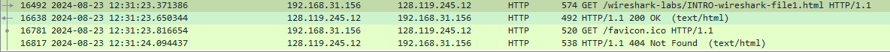
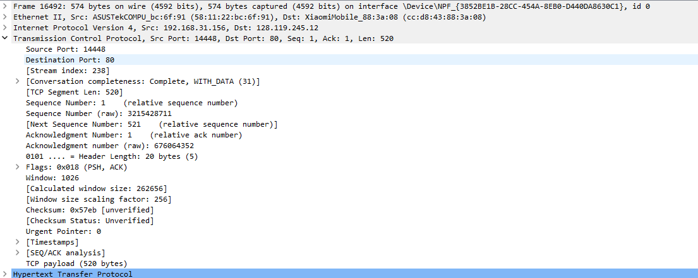

# question_answers

## q1

TCP、HTTP、DNS、TLSv1.2、OCSP

## q2

见图片 

## q3

128.119.245.12
192.168.31.156

## q4

Mozilla/5.0 (Windows NT 10.0; Win64; x64) AppleWebKit/537.36 (KHTML, like Gecko) Chrome/127.0.0.0 Safari/537.36 Edg/127.0.0.0

Firefox

## q5

14448

picture here 

## q6

printed to lab1.pdf
