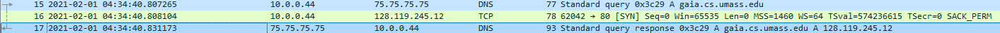
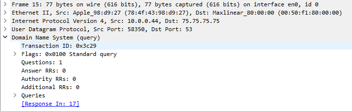

# question_answers

## 1

### q1

Server:         10.255.255.254 
Address:        10.255.255.254#53 

Non-authoritative answer: 
Name:   <text>www.iitb.ac.in</text> 
Address: 103.21.124.133 

ip address: 103.21.124.133

### q2

DNS server IP address: 10.255.255.254

### q3

Non-authoritative answer: 来自非权威服务器

### q4

nslookup -type=NS iitb.ac.in

Server:         10.255.255.254 
Address:        10.255.255.254#53 

Non-authoritative answer:
iitb.ac.in      nameserver = dns1.iitb.ac.in. 
iitb.ac.in      nameserver = dns2.iitb.ac.in. 
iitb.ac.in      nameserver = dns3.iitb.ac.in. 

权威服务器：dns1.iitb.ac.in

nslookup dns1.iitb.ac.in

Server:         10.255.255.254 
Address:        10.255.255.254#53 

Non-authoritative answer: 
Name:   dns1.iitb.ac.in 
Address: 103.21.125.129 

## 3

### 1

#### q5

15 号数据包

UDP

#### q6

17 号数据包

UDP

#### q7

DNS 查询消息的目标端口是 53 DNS 响应消息的源端口是 53

#### q8

75.75.75.75

#### q9

1 个问题 0 个答案

#### q10

1 个问题 1 个答案

#### q11

22 号数据包

15 号数据包

17 号数据包

205 号数据包

516 号数据包

15 号数据包

在没有 DNS 缓存的情况下, 最后一个问题的数据包与第二个问题不同, 在有 DNS 缓存的情况下, 最后一个问题的数据包与第二个问题相同

### 2

#### q12

DNS 查询消息的目标端口 53, DNS 响应消息的源端口是 53

#### q13

发送到 75.75.75.75 是的

#### q14

类型为 A

不包括答案

#### q15

1 个问题 1 个答案

### 3

#### q16

发送到 75.75.75.75 是的

#### q17

1 个问题 0 个答案

#### q18

1 个问题 3 个答案

有 Name, Type, Class, Time to live, Data length, Name Server

返回 3 个额外的资源记录

有 Name, Type, Class, Time to live, Data length, Address
