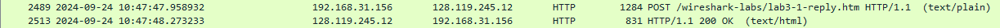
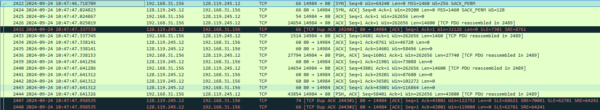
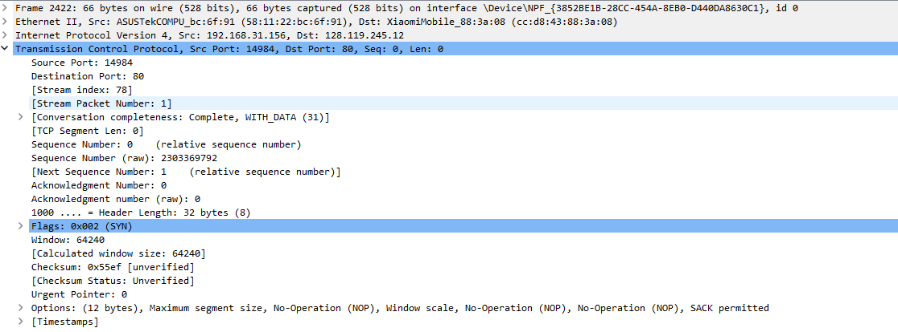
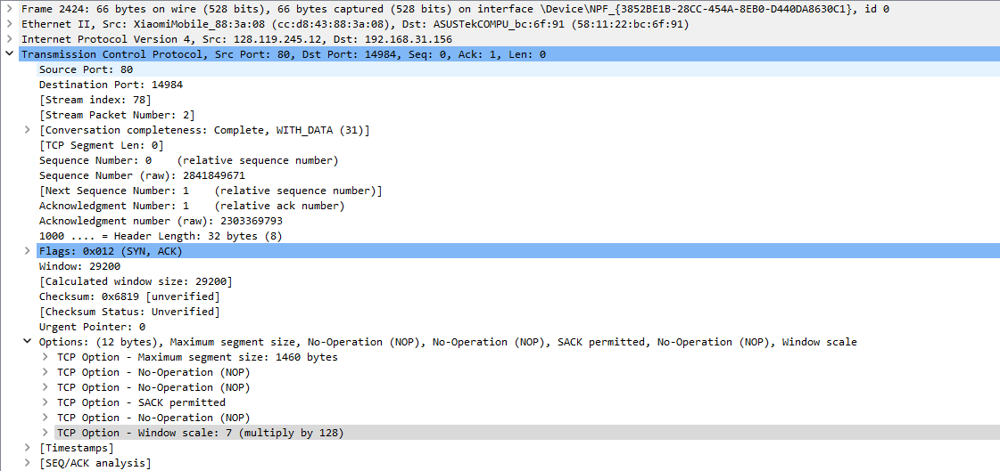
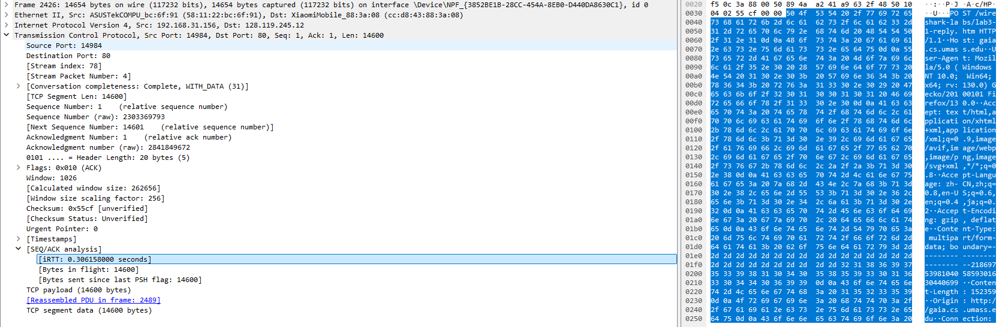
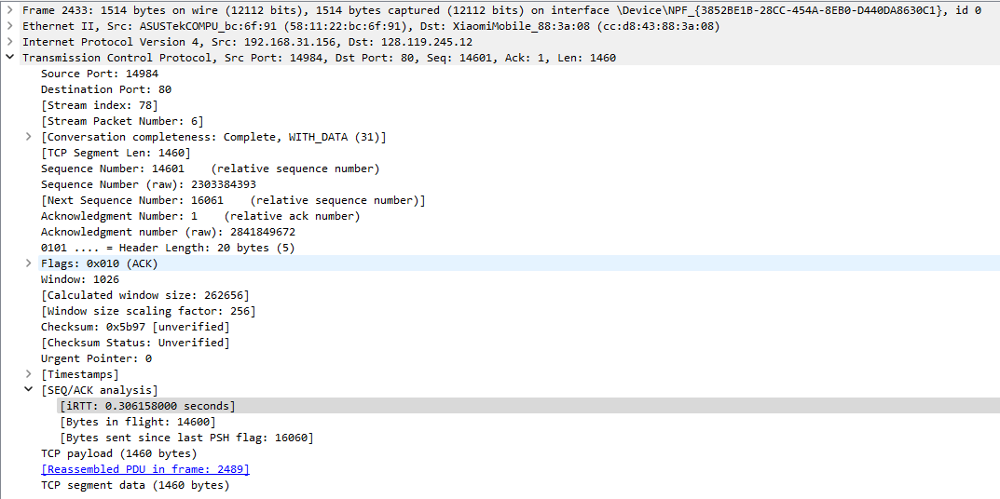
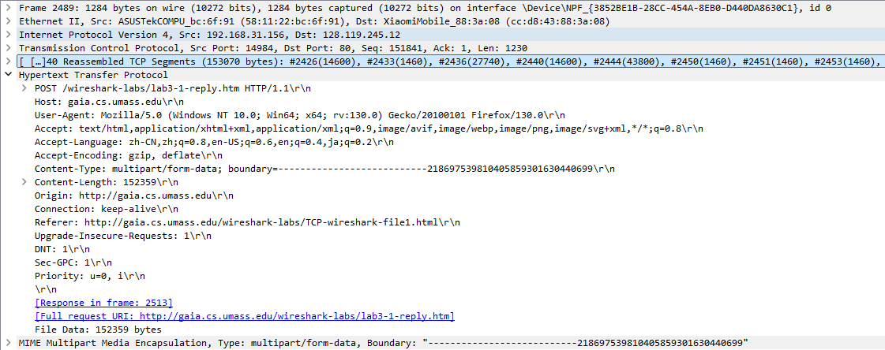
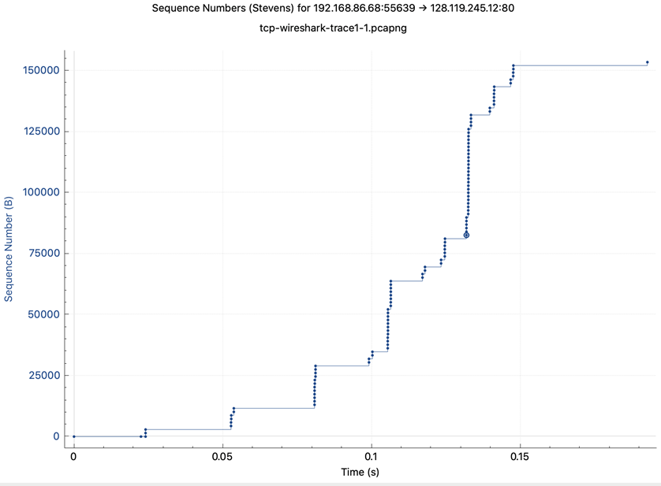

# question_answers

## 2

### q1

源 IP 地址 192.168.31.156, 源 TCP 端口号 14984

### q2

gaia.cs.umass.edu 的 IP 地址是 128.119.245.12, 它在 80 端口号上发送和接收此连接的 TCP 段

## 3

### q3

在客户端计算机和 gaia.cs.umass.edu 之间启动 TCP 连接的 TCP SYN 段的序列号是2303369792

此 TCP 段中将段标识为 SYN 段的是 Flags: 0x002 (SYN)

sack permitted, 所以此会话中的 TCP 接收器是能够使用选择性确认

### q4

gaia.cs.umass.edu 发送到客户端计算机以响应 SYN 的 SYNACK 段的序列号是 2841849671

此 TCP 段中将段标识为 SYNACK 段的是 Flags: 0x012 (SYN, ACK)

SYNACK 区段中 Acknowledgement 字段的值是 2303369793

gaia.cs.umass.edu 是将 SYN 段中的序列号 + 1 作为 SYNACK 段的确认号

### q5

包含 HTTP POST 命令标头的 TCP 段的序列号是2426

此 TCP 分段的 payload （data） 字段中包含 14600 字节的数据

传输文件 alice.txt 中的所有数据并不全在此分段中

### q6

TCP 连接的数据传输部分的第一个段是在 2024-09-24 10:47:47.025019 发送的

2024-09-24 10:47:47.338141 收到第一个包含数据的区段的 ACK

第一个包含数据的区段的 RTT 是 0.000152s

第二个承载数据的 TCP 段的 RTT 值 0.000017s, ACK 是 2841849672

收到第二个数据承载段的 ACK 后，EstimatedRTT 值

$$
EstimatedRTT = (1 - \alpha) * EstimatedRTT + \alpha * SampleRTT = 0.875 * 0.000152s + 0.125 * 0.000017s = 0.000135125s
$$

### q7

14654 1514 27794 14654

### q8

最小为 46720

确实限制了发送方的发送速率, 第二个包的大小只有 1514 字节

### q9

检查是否有重叠的数据包, 结果没有发现, 故没有发生重传

### q10

8760 5840 7300 7300 7300 7300 ...

一般确认 7300B 的数据

### q11

最终的 nextSeqNum 是 153071 故总共传输 153070 字节, 开始链接时间是 10:47:47.025019, 完成时间是 2024-09-24 10:47:47.958932, 共用时 47.958932 - 47.025019 = 0.933913s, 吞吐量为 153070 / 0.933913 = 163,798.5 字节/秒

## 4

这里使用作者给出的流量包作答

### q12

应当处于慢启动阶段

### q13

阶段性上升是因为在经过一个 RTT 后, 到达的 ACK 使得 cwnd 增加了 1 MSS, 每个批次的包发送的时间大致相同, 收到 ACK 的时间也大致相同, 故 cwnd 的增长是阶段性的
