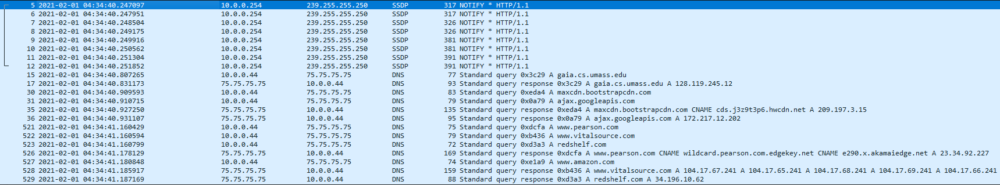
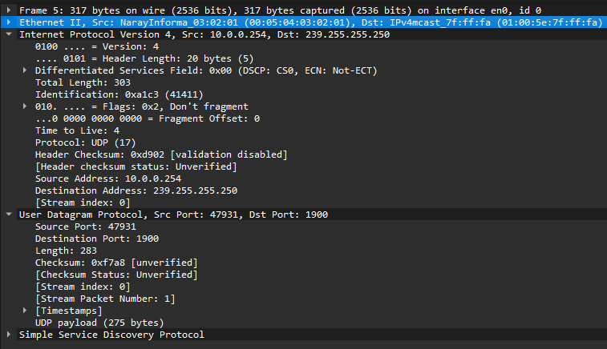
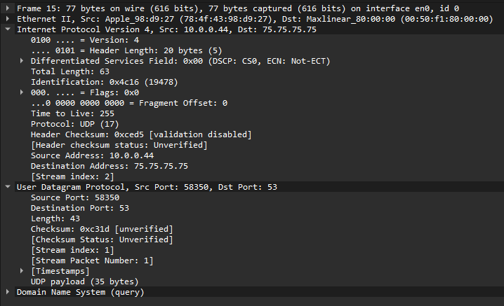
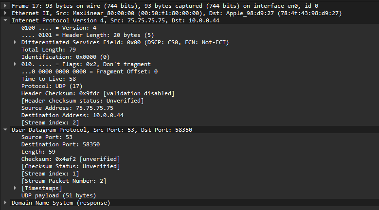

# question_answers

本机中程序过多, 导致有大量的 UDP 数据包, 故本节使用官方提供的数据包

## q1

跟踪文件中第一个 UDP 分段的数据包编号是5

此 UDP 分段中承载了SSDP

UDP 标头中有4个字段, 分别是 Source Port, Destination Port, Length, Checksum

## q2

每个 UDP 报头字段的长度是 2 字节

## q3

Length 字段中的值是整个 UDP 报文的长度, 包括报头和数据

## q4

UDP 负载中可以包含的最大字节数是 $2^{16} - 1 - 8 = 65527$

## q5

可能的最大源端口号是 $2^{16} - 1 = 65535$

## q6

UDP 的协议号是 17

## q7

选择一对 DNS 答复, 跟踪文件中这两个 UDP 段中第一个段的数据包编号是15

此 UDP 分段中 source port 字段中的值是10.0.0.44

此 UDP 分段中目标端口字段中的值是58350

跟踪文件中这两个 UDP 段中第二个段的数据包编号是16

第二个 UDP 分段中 source port 字段中的值是75.75.75.75

第二个 UDP 分段中目标端口字段中的值是53

第一个数据包的源端口号是第二个包的目标端口号, 第一个数据包的目标端口号是第二个包的源端口号
