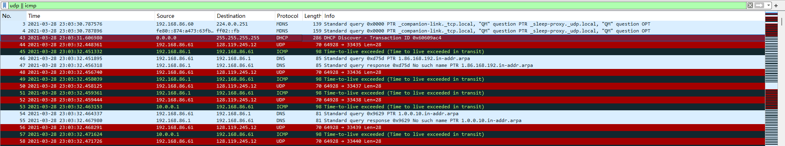

# question_answers

本机为 Windows 操作系统, 故直接使用作者提供的数据包进行试验.

## part 1

### q01

本机的 IP 地址为 192.168.86.61

### q02

TTL 的值为 1

### q03

Protocol: UDP (17)

### q04

IP 报头长度为 20 字节

### q05

有效载荷长为总长减去报头长度 $56-20=36(B)$

### q06

查看标志字段的值为 0x0, 也就是说最低的 MF 位为 0, 说明这是最后一个分片, Fragment Offset 为 0 说明是第一个分片, 故没有发生分片.

### q07

Identification 和 Header Checksum 总是在各个 datagram 中不同.

### q08

Source, Destination, Total Lenth, Flags, Fragment Offset, Protocol 等没有发生变化.

Source 和 Destination 不变是因为收发的主机不变.

Total Length 和 Protocol 和 Fragment Offset 不变是因为发送的数据包的性质和内容几乎不变.

### q09

每个 datagram 的 Identification 字段的值逐步加一.

### q10

Protocol: ICMP (1)

### q11

从同一源发出的 datagram 的 Identification 递增, 但增量不一定是 1.

### q12

从同一源发出的 datagram 的 TTL 相同, 但是没有变化规律.

## part 2

### q13

第 179 号数据包.

在多个 IP 数据报中分段.

### q14

除了最后一个数据包的标志位为0x1, 故 MF 为 1, 除了第一个后续的几个数据包的 Fragment Offset 不为 0, 都代表了分片的发生.

### q15

MF 为 0 代表最后一个分片, Fragment Offset 为 0 代表第一个分片.

### q16

第一个和第二个的总长为 1500, 最后一个为 40, 每个分片的首部长为 20, 故总计为 2980

### q17

Fragment Offset 不为 0.

### q18

标志, Fragment Offset, Header Checksum 发生变化.

### q19

查看标志字段的值为 0x0, 也就是说最低的 MF 位为 0, 说明这是最后一个分片.

## part 3

20号包是要研究的包

### q20

发出的源地址是 2601:193:8302:4620:215c:f5ae:8b40:a27a

### q21

目标地址是 2001:558:feed::1

### q22

流标签为 0110 0011 1110 1101 0000 = Flow Label: 0x63ed0

### q23

有效载荷长度为 37

### q24

Next Header: UDP (17)

### q25

第 27 号包是相应的应答, 返回了 1 个 IPv6 地址

### q26

youtube.com: type AAAA, class IN, addr 2607:f8b0:4006:815::200e
