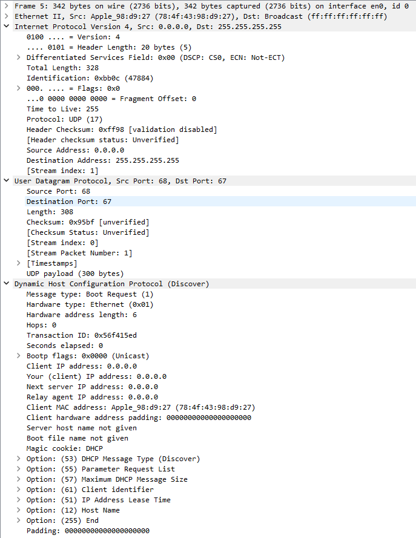

# question_answers

直接使用作者提供的数据包进行试验.

5 号包是跟踪中第一条 Discover 消息的 IP 数据报.

## q01

使用 UDP 协议 (17) 传输 DHCP 数据包.

## q02

包含 Discover 消息的 IP 数据报中使用的源 IP 地址是 0.0.0.0, 由于没有分配 IP 地址, 所以使用 0.0.0.0 代表本机.

## q03

包含 Discover 消息的数据报中使用的目标 IP 地址是 255.255.255.255, 由于不知道 DHCP 服务器的 IP 地址, 所以使用本地网络的广播地址.

## q04

Transaction ID: 0x56f415ed

## q05

- Parameter Request List Item: (121) Classless Static Route
- Parameter Request List Item: (3) Router
- Parameter Request List Item: (6) Domain Name Server
- Parameter Request List Item: (15) Domain Name
- Parameter Request List Item: (252) Private/Proxy autodiscovery

Parameter Request List, Maximum DHCP Message Size, Client identifier, IP Address Lease Time, Host Name

12 号包是跟踪中第一条 Offer 消息的 IP 数据报.

## q06

二者的 Transaction ID 相同.

## q07

含 Offer 消息的数据报中使用的源 IP 地址是 192.168.86.1, 这是 DHCP 服务器的 IP 地址.

## q08

含 Offer 消息的数据报中使用的目标 IP 地址是 192.168.86.65, 这是 DHCP 服务器分配给客户端的 IP 地址.

## q09

Option: (28) Broadcast Address (192.168.86.255)
Option: (3) Router
Option: (15) Domain Name
Option: (6) Domain Name Server

16 号包是跟踪中第一条 Request 消息的 IP 数据报.

## q10

包含跟踪中第一条 DHCP 请求消息的 IP 数据报中的 UDP 源端口号是68, 正在使用的 UDP 目标端口号是 67

## q11

包含此请求消息的 IP 数据报中的源 IP 地址是 0.0.0.0, 由于 IP 地址没有得到确认, 所以使用 0.0.0.0 代表本机.

## q12

包含此请求消息的数据报中使用的目标 IP 地址是 255.255.255.255, 由于 IP 地址没有得到确认, 所以使用本地网络的广播地址.

## q13

Transaction ID: 0x56f415ed, 与此前的 Transaction ID 相同.

## q14

Parameter Request List 与此前相同.

17 号包是跟踪中第一条 ACK 消息的 IP 数据报.

## q15

包含此ACK消息的 IP 数据报中的源 IP 地址是 192.168.86.1, 这是 DHCP 服务器的 IP 地址.

## q16

包含此ACK消息的 IP 数据报中的目标 IP 地址是 192.168.86.65, 这是 DHCP 服务器分配给客户端的 IP 地址.

## q17

Option: (28) Broadcast Address (192.168.86.255)

## q18

Rebinding Time Value: 21 hours (75600)

## q19

Option: (3) Router (192.168.86.1)
