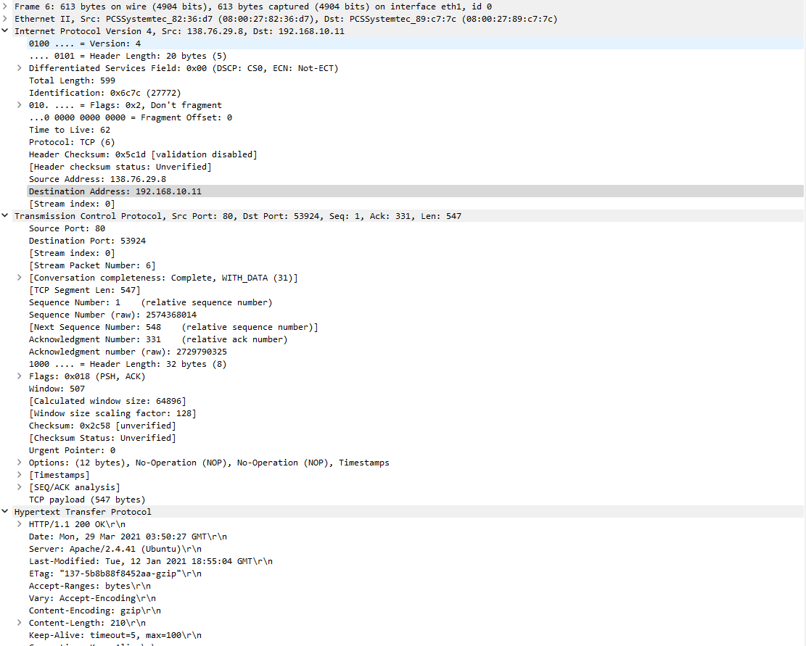

# question_answers

直接使用作者提供的数据包进行试验.

## q01

HTTP GET 请求的客户端的 IP 地址是 192.168.10.11

此包含 HTTP GET 请求的数据报中 TCP 段的源端口号是 53924

此 HTTP GET 请求的目标 IP 地址是 138.76.29.8

此包含 HTTP GET 请求的数据报中 TCP 分段的目标端口号是 80

## q02

0.030672101 s

## q03

HTTP 200 OK 消息源 IP 地址是 138.76.29.8

HTTP 200 OK 消息 TCP 段的源端口号是 80

HTTP 200 OK 消息目标 IP 地址是 192.168.10.11

HTTP 200 OK 消息的数据报中 TCP 分段的目标端口号是 53924

## q04

0.027356291 s

## q05

HTTP GET 请求的客户端的 IP 地址是 10.0.1.254

此包含 HTTP GET 请求的数据报中 TCP 段的源端口号是 53924

此 HTTP GET 请求的目标 IP 地址是 138.76.29.8

此包含 HTTP GET 请求的数据报中 TCP 分段的目标端口号是 80

## q06

源 IP 地址发生了变化

## q07

HTTP 消息没有任何变化

## q08

版本, 报头长度, 标志, 校验和应全部和外网一致

## q09

0.030625966 s

## q10

HTTP 200 OK 消息源 IP 地址是 138.76.29.8

HTTP 200 OK 消息 TCP 段的源端口号是 80

HTTP 200 OK 消息目标 IP 地址是 10.0.1.254

HTTP 200 OK 消息的数据报中 TCP 分段的目标端口号是 53924

## q11

图 1 右侧携带从路由器转发到目标主机的 HTTP 应答 ("200 OK") 的 IP 数据报上的源 IP 地址是 138.76.29.8

目标 IP 地址是 192.168.10.11

TCP 源端口号是 80

目标端口号是 53924
