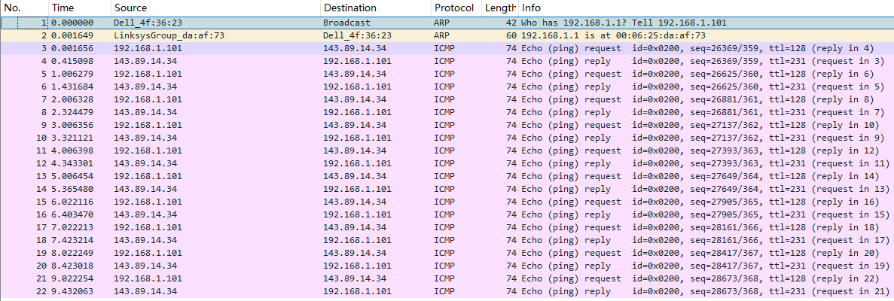
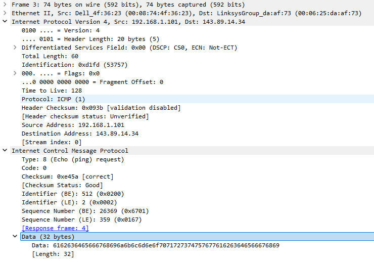
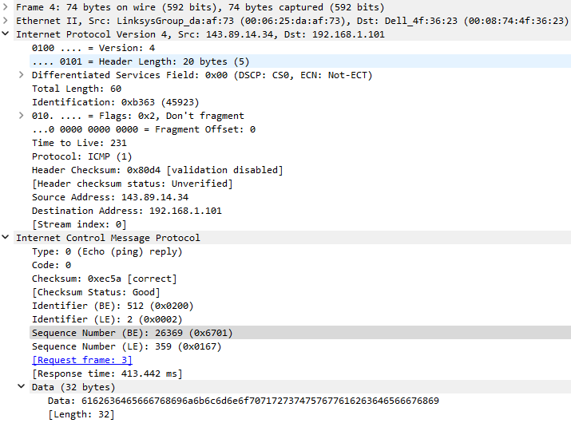
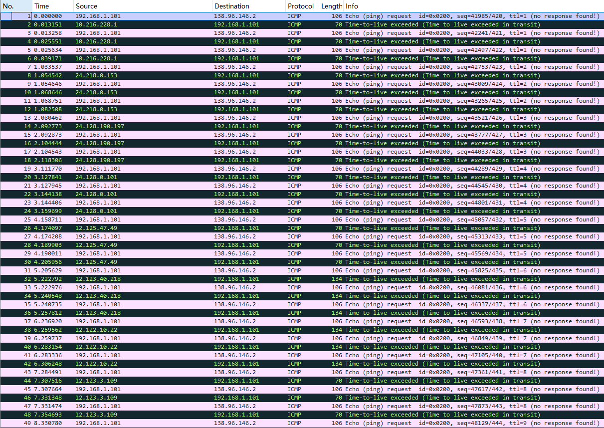
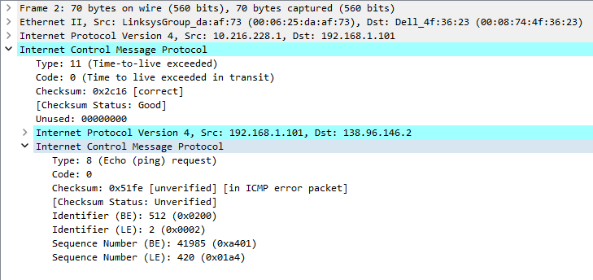
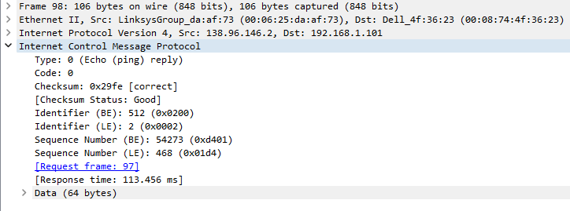

# question_answers

直接使用作者提供的数据包进行试验.

## q01

主机的 IP 地址是 192.168.1.101

目标主机的 IP 地址是 143.89.14.34

## q02

ICMP 是一个网络层协议, 是用于传输网络层的错误信息的, 不需要区分端到端的连接, 不使用 UDP 或者 TCP 协议, 所以没有端口号.

## q03

ICMP 类型 8 代码 0

还有 Checksum (2 B), Identifier (2 B), Sequence number (2 B)

## q04

ICMP 类型 0 代码 0

还有 Checksum (2 B), Identifier (2 B), Sequence number (2 B)

## q05

主机的 IP 地址是 192.168.1.101

目标主机的 IP 地址是 138.96.146.2

## q06

作者使用 Windows 主机, 这里发送的仍然是 ICMP 报文, 故 IP 协议号为 1.

## q07

返回的是 ICMP 类型 11 代码 0 的 TTL 超时报文.

## q08

增加了 Unused 字段和超时的 IP 数据报部分 (包括头部和数据部分).

## q09

因为成功到达了目标主机, 所以返回的是 ICMP 类型 0 代码 0 的回复报文.

## q10

作者提供的图片中第一条线路可能较长, 根据名称链路的末端位于法国 (fr)
