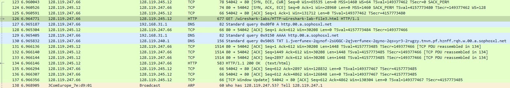
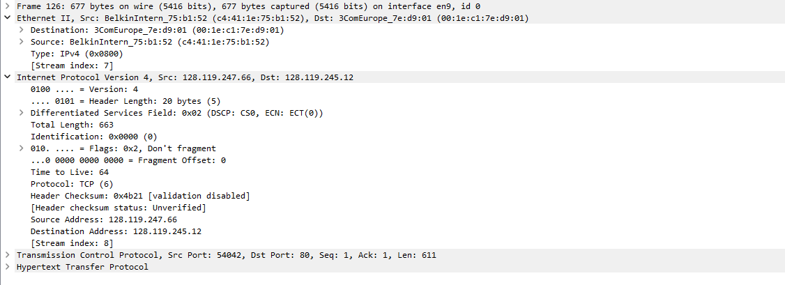
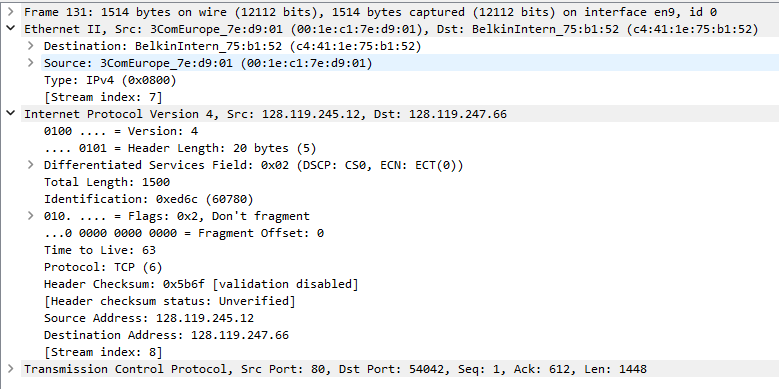
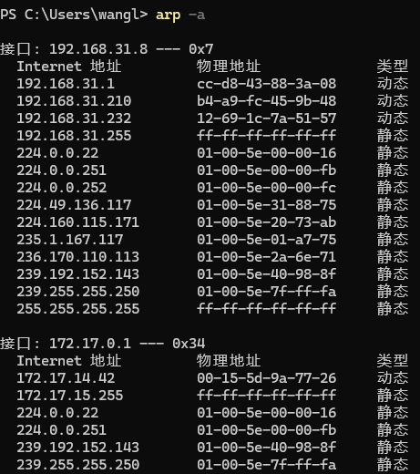
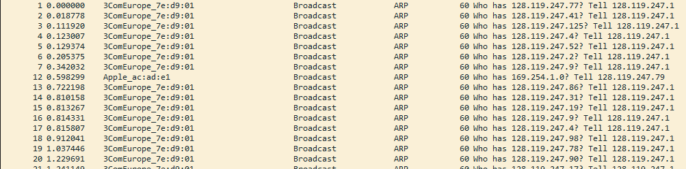
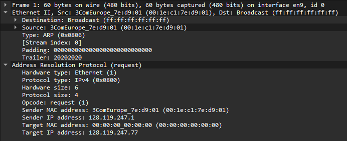
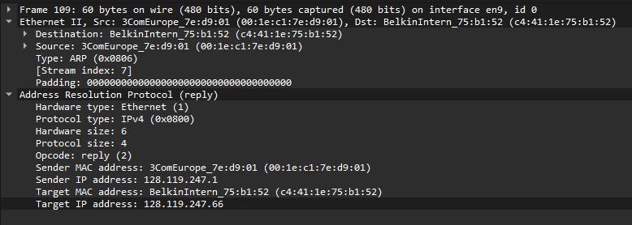

# question_answers

直接使用作者提供的数据包进行试验.

## Ethernet

### q01

Source: BelkinIntern_75:b1:52 (c4:41:1e:75:b1:52)

所以本机的 MAC 地址是 c4:41:1e:75:b1:52.

### q02

Destination: 3ComEurope_7e:d9:01 (00:1e:c1:7e:d9:01)

所以目标 MAC 地址是 00:1e:c1:7e:d9:01. 这不是 gaia.cs.umass.edu 的 MAC 地址. 是发往的路由器的 MAC 地址.

### q03

Type: IPv4 (0x0800)

Frame type 是 0x0800, 对应于 IPv4.

### q04

G 文本出现在 0x0042 处.

### q05

Source: 3ComEurope_7e:d9:01 (00:1e:c1:7e:d9:01)

源 MAC 地址是 00:1e:c1:7e:d9:01. 是路由器的 MAC 地址.

### q06

Destination: BelkinIntern_75:b1:52 (c4:41:1e:75:b1:52)

目标 MAC 地址是 c4:41:1e:75:b1:52. 是本机的 MAC 地址.

### q07

Frame type 是 0x0800, 对应于 IPv4.

### q08

O 位于 0x004f 处.

### q09

共 4 个以太网帧承载的数据是完整的 HTTP "OK 200 ..." 回复消息.

## ARP

### q10

共有 20 个条目

### q11

每个条目有 4 个字段: IP 地址, MAC 地址, 类型.

### q12

本机的 MAC 地址为  00:1e:c1:7e:d9:01

### q13

包含计算机发出的 ARP 请求消息的以太网帧中目标地址的十六进制值是 ff:ff:ff:ff:ff:ff 因为这是第一个发出的 ARP 寻址, 所以这是一个广播地址

### q14

Ethernet Frame type 为 0x0806, 对应于 ARP.

### q15

操作码位于第 6 个字段.

### q16

本机发送的请求消息中的 opcode 字段的值是 1 (request)

### q17

Sender IP address: 128.119.247.1

包含发送方 IP 地址 128.119.247.1

### q18

Target IP address: 128.119.247.77

这个 ARP 请求消息中请求其对应以太网地址的设备的 IP 地址是 128.119.247.77

### q19

ARP 回复消息中的 opcode 字段的值是 2 (reply)

### q20

Target MAC address: BelkinIntern_75:b1:52 (c4:41:1e:75:b1:52)

目标 IP 127.119.247.1 回复的 MAC 地址为 c4:41:1e:75:b1:52, 也就是本机 MAC 地址

### q21

这些设备要求的 IP 地址和本机不同, 所以被自动丢弃

## EX

### EX1

发往此 IP 地址的包将被发向错误的端口, 可以被监听

### EX2

<https://learn.microsoft.com/en-us/troubleshoot/windows-server/networking/address-resolution-protocol-arp-caching-behavior>

1. 利用 `netsh interface ipv4 show interfaces` 查看以太网的 index
2. 利用 `netsh interface ipv4 show interface index` 查看基本可访问时间 (30000 毫秒)
3. 缓存时间 $Reachable Time = BaseReachable Time \times \text{random(0.5 to 1.5)ms}$
